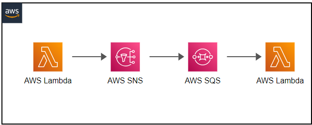

# go-sns-sqs-serverless



Creates one Lambda function that sends a message to an SNS topic. That topic sends the message to a SQS queue and finally another Lambda picks the message.

This sample project demonstrates how to create a SNS + SQS system, in which all the messages sent by a publisher are sent to all the consumers, and there is a buffer between the message producer and the consumer. In this way the consumers don't get overload with messages.

## How it works

Creates a Lambda function that sends a message to a SNS. A SQS queue is subscribed to all the messages from the SNS topic. When there is a message in the queue, another function gets triggered.

## Advantage of using Lambda to SNS to SQS to Lambda

Primary advantage of having a SQS in between SNS and Lambda is Reprocessing. Assume that the Lambda fails to process certain event for some reason (e.g. timeout or lack of memory footprint), you can increase the timeout (to max 5 minutes) or memory (to max of 1.5GB) and restart your polling and you can reprocess the older events.

This would not be possible in case of SNS to Lambda, where in if Lambda fails the event is lost. And even if you configure DLQ you would still have to make provisions for reading that separately and processing the message

So if your events are critical and you don't want to miss out on them, then go for SNS - SQS - Lambda

The other advantage of having SQS is cost saving on Lambda invocations. You can have much better scaling and less cost, as it allows you to process messages in batches. So one lambda can be executed for a batch of 10 messages while in case of direct SNS each message would trigger a lambda invocation.

# Install Serverless Framework and relative plugins

```
npm install -g serverless
npm install -g serverless-hooks-plugin
npm install -g @agiledigital/serverless-sns-sqs-lambda
```

# Deployment

Run deploy:

```
make deploy
```
